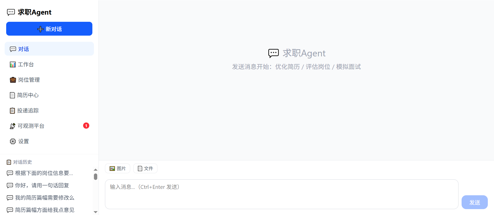
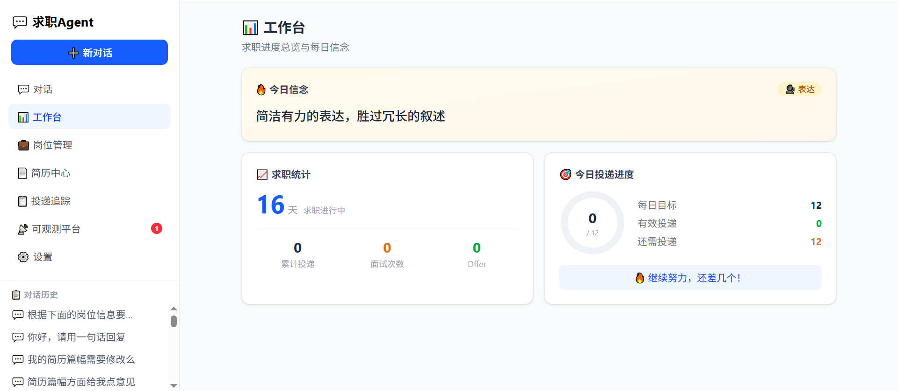
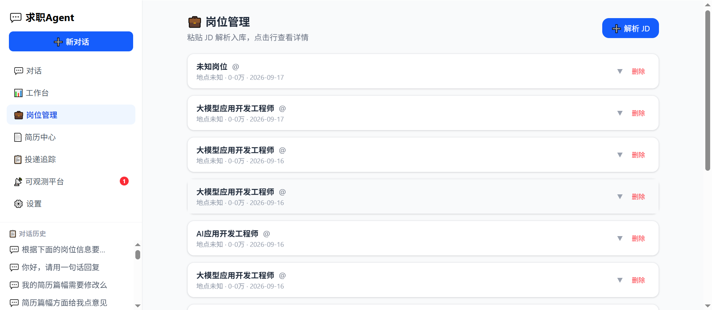
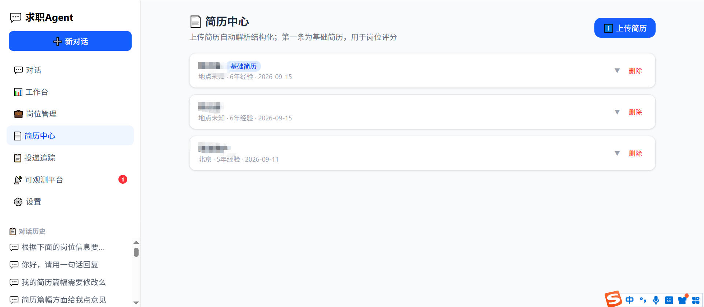
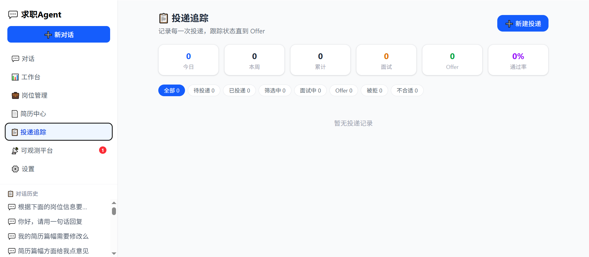
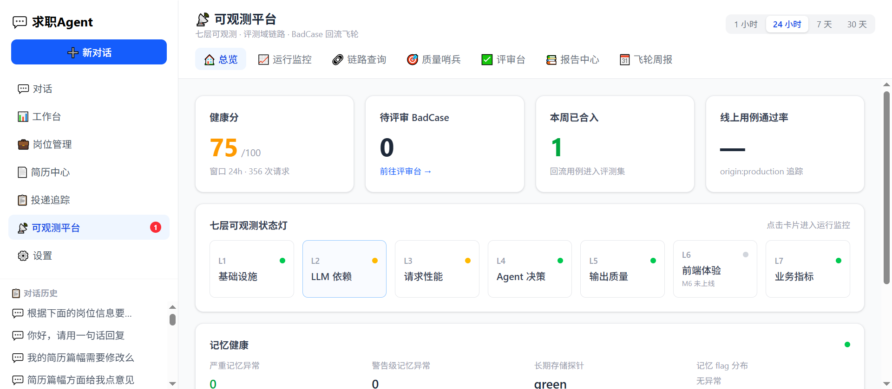
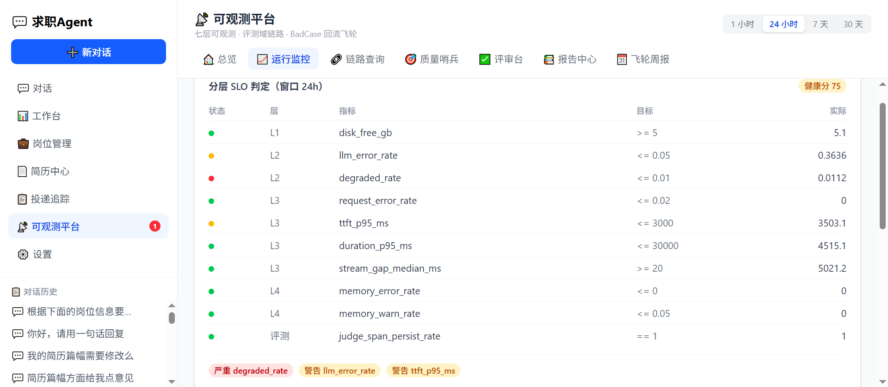
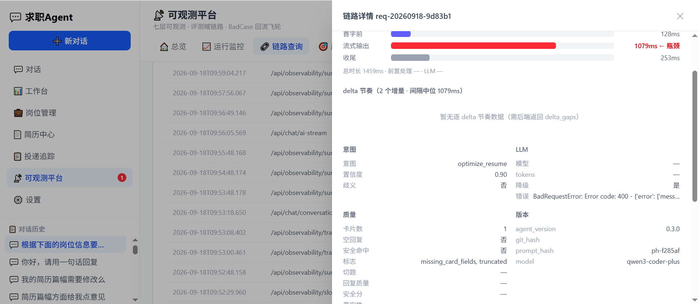
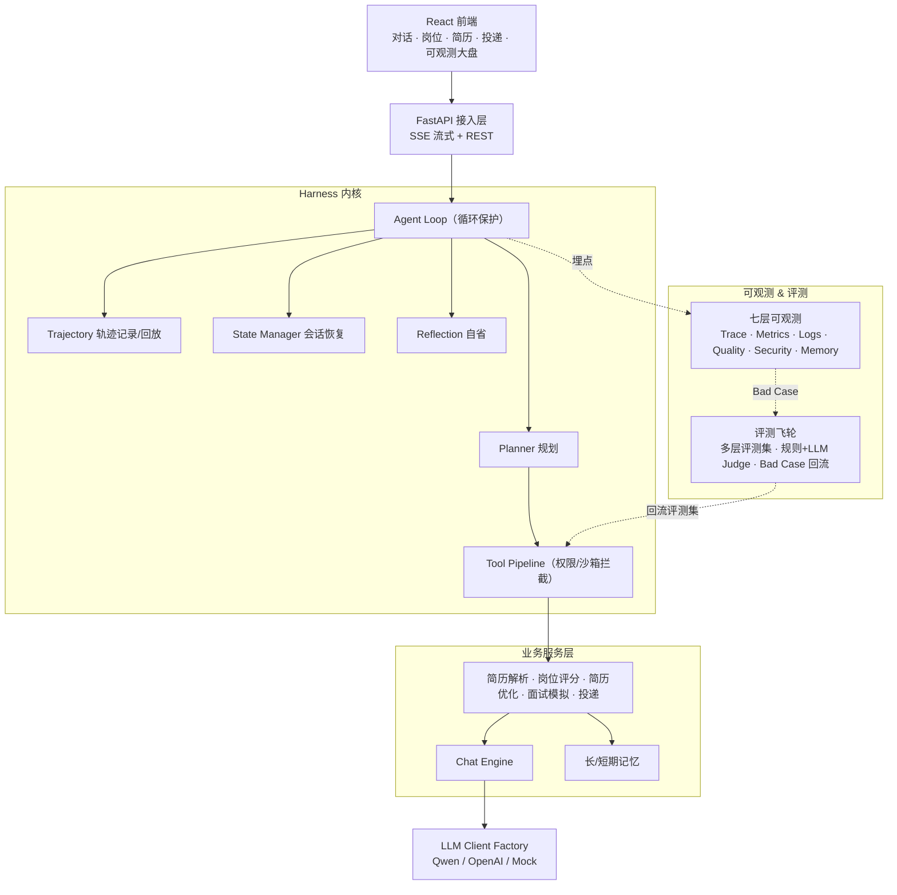
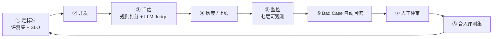

<div align="center">

# 求职 Agent · Job Agent

**一个生产级 AI Agent 的「可观测 + 评测飞轮」参考实现**

以「智能求职助手」为业务载体，完整演示如何把一个 LLM Demo 工程化为
**可追踪、可评估、可自我迭代**的生产系统。

_A production-grade reference for **Agent Observability + Evaluation Flywheel**, built on a job-hunting assistant._


</div>

---

## 这个项目到底是什么

市面上不缺「又一个求职工具」。这个项目真正想回答的是另一个问题：

> **一个 LLM Agent，怎样才能从「跑通的 Demo」变成「敢上生产的系统」？**

答案是三件事，也是本项目的三条主线：

1. **可观测**——每一次对话的思考链、工具调用、记忆读写、Token 成本、延迟、质量分、安全命中，全部可追踪、可回放、可告警。
2. **可评估**——一套分层评测集 + 规则打分 + LLM Judge，让「改了一版到底变好还是变坏」变成可量化的数字，而不是拍脑袋。
3. **可迭代**——线上 Bad Case 自动回流 → 人工评审 → 合入评测集 → 下版本回归，形成**评估驱动开发的飞轮**。

求职业务（简历解析、岗位评分、简历优化、面试模拟、投递追踪）只是承载这套工程能力的**真实场景**——它足够复杂（多轮、工具、记忆、幻觉风险、安全边界），能真正压测这套方法论。

---

## 核心亮点

| 能力 | 说明 |
|------|------|
| **Harness 工程内核** | 模型与执行分离；工具调用前经权限/沙箱拦截；完整轨迹可审计回放；会话状态可恢复；轮次上限/超时/终止策略等循环保护。 |
| **七层可观测平台** | Trace 链路追踪 + 请求级埋点 + 在线质量哨兵 + 安全扫描（注入/敏感信息）+ 记忆健康监测 + SLO 告警 + 健康分，自带 **React 可视化大盘**。 |
| **评估驱动飞轮** | 多层评测集 + 规则打分器 + LLM Judge + Bad Case 自动回流 + 人工评审合入 + 版本回归对比，闭环运转。 |
| **幻觉 & 长程记忆治理** | 会话结构化锚点注入抑制上下文丢失；以库内简历为「地面真相」的在线幻觉检测；长期记忆存储探针。 |
| **零门槛体验** | 内置 `MockClient`，`LLM_PROVIDER=mock` 即可**无需任何 API Key** 跑通全链路。 |

---

## 功能演示

### 对话式交互（核心入口）



### 业务功能

| 工作台：求职进度与每日信念 | 岗位管理：JD 解析入库 |
|:---:|:---:|
|  |  |
| **简历中心**：上传自动解析结构化 | **投递追踪**：状态跟踪直到 Offer |
|  |  |

### 可观测平台（核心亮点）

| 总览：健康分 + 七层状态灯 + 记忆健康 | 运行监控：分层 SLO 判定与告警 |
|:---:|:---:|
|  |  |

链路详情：首字/流式/收尾耗时分解、意图置信度、LLM 错误、质量标志、版本指纹一键可查。



---

## 架构总览



## 评估驱动飞轮

这是本项目最核心的方法论——**让 Agent 的质量随每一次迭代单调上升**：



- **回流**：`ProductionBadCaseCollector` 从线上 `quality.jsonl` 中筛出空回复、卡片缺字段、安全命中、低质量分的请求，生成待评审草稿。
- **评审**：可观测大盘的评审队列里，人工对每条草稿 `merge`（补上期望行为，合入评测集）或 `discard`（记原因归档）。
- **回归**：`VersionComparator` 用同一评测集对比新旧版本，精确到「哪些用例被修好、哪些发生回退、红线违规变化」。

---

## 七层可观测模型

`GET /api/observability/summary` 返回一个 **0-100 健康分**（critical −15 / warning −5）与七层状态灯：

| 层 | 监测对象 | 关键指标 |
|----|----------|----------|
| **L1** 基础设施 | 磁盘/运行时 | 可用空间 |
| **L2** LLM 层 | 模型调用健康 | LLM 错误率、降级次数、Token 成本 |
| **L3** 体验层 | 响应性能 | 首字延迟 TTFT P95、请求错误率、中断率 |
| **L4** 认知层 | 意图/安全/记忆 | 意图模糊率、注入&敏感命中、记忆异常、长期存储探针 |
| **L5** 质量层 | 回复质量 | 在线质量分、空回复率 |
| **L6** 业务层 | 任务成效 | _规划中_ |
| **L7** 分布层 | 意图画像 | Top 意图分布 |

> 告警采用**收敛机制**：打扰型 critical（注入命中/记忆异常）仅统计最近 1h，同类未复现即自动收敛，避免告警疲劳。

**可观测 API（前缀 `/api/observability`）**：`/summary` 总览 · `/badcases` 评审队列 · `/badcases/{id}/review` 评审 · 以及链路/指标/SLO/质量/报告中心/周报等聚合端点。

---

## 功能总览（业务载体）

| 功能 | 说明 |
|------|------|
| 💬 对话式交互 | SSE 流式、可中断生成、Markdown 渲染、结构化卡片 |
| 📄 简历解析 | PDF / Word / 文本 → 结构化数据，解析失败自动降级 |
| 💼 岗位评估 | 5 维度评分（技能/经验/薪资/学历/城市）+ 稳定性分析 |
| 📝 简历优化 | 基于 JD 逐条改写，带 diff 对比 + 关键词覆盖率，**真实性约束（不编造经历）** |
| 🎯 面试模拟 | 技术面 + 行为面（STAR）+ HR 面，回答质量评估 |
| 📊 投递追踪 | 投递状态与进度统计 |
| 🧠 长程记忆 | 跨会话记忆 + 会话锚点注入，抑制多轮上下文丢失 |

---

## 快速开始

### 0. 环境要求

| 依赖 | 版本 | 必需 |
|------|------|------|
| Python | 3.9+ | 是 |
| Node.js | 18+（仅构建前端时需要） | 构建前端时 |
| LLM API Key | 通义千问 / OpenAI 兼容协议 | 否（Mock 模式无需） |

### 1. 克隆与安装

```bash
git clone https://github.com/qwwweerfghbv/Agent-Observability-Flywhee.git
cd Agent-Observability-Flywhee
python -m venv venv && source venv/bin/activate   # Windows: venv\Scripts\activate
pip install -r requirements.txt
```

### 2. 零门槛体验（Mock 模式，无需 API Key）

复制一份配置，默认即用 Mock 客户端跑通全链路：

```bash
cp .env.example .env      # 保持 LLM_PROVIDER=mock
uvicorn app.main:app --port 8000
```

打开 http://127.0.0.1:8000 —— Mock 模式会返回结构逼真的假数据，用于验证链路、可观测大盘与评测流程，**不消耗任何 Token**。

### 3. 接入真实大模型

编辑 `.env`：

```env
LLM_PROVIDER=qwen                 # 或 openai
QWEN_API_KEY=your_api_key_here
QWEN_MODEL=qwen-plus
# OPENAI_API_KEY=your_key        # provider=openai 时使用
# OPENAI_BASE_URL=...            # 兼容 OpenAI 协议的服务均可
```

> `LLM_PROVIDER` 支持 `qwen` / `openai` / `mock`，由 `LLMClientFactory` 统一切换。凡兼容 OpenAI 协议的服务，配置 `base_url` 即可接入。

### 4. 前端

**生产模式（推荐，单端口）**：后端直接托管 React 构建产物 `web/dist`。

```bash
cd web
npm install
npm run build          # Windows 若遇 npm shim 问题：node node_modules/vite/bin/vite.js build
cd ..
uvicorn app.main:app --port 8000    # 访问 http://127.0.0.1:8000 即完整应用
```

**开发模式（热更新）**：

```bash
cd web && npm run dev   # vite :5173，/api 代理到 :8000；后端需另开一个进程
```

### 5. 测试与评测

```bash
pytest tests/                              # 单元 + 集成
python tests/eval/run_eval_script.py       # 跑评测集，产出报告与 Bad Case
python tests/eval/run_perf_eval.py         # 性能专项（需后端已启动）
```

### 6. Docker 一键部署（推荐，零 Key 起全栈）

无需本地安装 Python/Node，一条命令拉起「后端 + React 前端」单端口全栈（默认 Mock 模式）：

```bash
docker compose up --build
```

启动后访问 http://127.0.0.1:8000 即完整应用（含可观测大盘）。接入真实大模型：

```bash
cp .env.example .env        # 编辑 LLM_PROVIDER=qwen 与 QWEN_API_KEY
docker compose up --build    # compose 自动读取 .env 做变量替换
```

> 运行时数据（DB / 上传 / 可观测落盘）经 `./data` 卷持久化；镜像为多阶段构建——前端在 `node:22` 阶段编译、后端在 `python:3.11-slim` 运行；`.env` 与密钥经 `.dockerignore` 排除，不会进镜像。

---

## 使用示例

启动后访问 `http://127.0.0.1:8000/docs` 可查看完整的交互式 API（Swagger）。一次典型的使用流程：

1. **上传简历** → 自动解析为结构化数据（简历中心），第一条作为基础简历；
2. **粘贴 JD** → 解析入库 + 5 维评分 + 稳定性分析（岗位管理）；
3. **对话「优化简历」** → 生成逐条修改 diff + 关键词覆盖率，真实性约束不编造经历；
4. **对话「模拟面试」** → 技术/行为/HR 三面出题 + 回答质量评估；
5. **记录投递** → 状态跟踪直到 Offer，工作台汇总进度（投递追踪）；
6. **复盘** → 在可观测平台查看每次对话的链路耗时、质量分、安全命中，并把 Bad Case 回流进评测集。

健康检查：

```bash
curl http://127.0.0.1:8000/health
```

---

## 项目结构

```
Agent-Observability-Flywhee/
├── app/
│   ├── harness/          # Harness 内核：agent_loop / planner / tool_pipeline /
│   │                     #   trajectory / state_manager / reflection / llm_adapter
│   ├── services/         # 业务服务：chat_engine / 简历 / 岗位 / 面试 / 投递
│   ├── observability/    # 可观测：context(Trace) / writers(落盘) / quality(在线质量) /
│   │                     #   security(安全扫描) / memory_guard(记忆监测)
│   ├── llm/              # LLM 客户端工厂：Qwen / OpenAI / Mock
│   ├── memory/           # 长期 / 短期记忆
│   ├── api/              # FastAPI 路由（含 observability 聚合 API）
│   ├── db/               # SQLAlchemy 模型与仓储
│   └── main.py
├── web/                  # React + Vite + AI SDK 前端（含可观测大盘）
├── tests/
│   ├── unit/  integration/
│   └── eval/             # 评测飞轮：eval_runner / rule_scorer / llm_judge_scorer /
│                         #   flywheel(回流) / monitor / patrol / 多层评测集
├── docs/                 # 设计文档（SDD / 可观测建设指南 / 评测方法论）
└── data/                 # 运行时数据（不入库）
```

---

## 技术栈

| 维度 | 选型 |
|------|------|
| 后端 | Python 3.9+ · FastAPI · SQLAlchemy · Pydantic |
| LLM | 通义千问 / OpenAI 兼容协议 / Mock（工厂可插拔） |
| 前端 | React 18 · Vite · Vercel AI SDK · TypeScript |
| 可观测 | 自研轻量 Trace 埋点 · JSONL 落盘 · SLO 判定 |
| 评测 | pytest · 规则打分器 · LLM Judge · Bad Case 飞轮 |
| 存储 | SQLite（可平滑迁移 PostgreSQL） |

---

## 合规与隐私边界

本项目在设计上明确**不做**任何违反招聘平台规则或存在欺诈风险的事：

| 功能 | 策略 |
|------|------|
| 自动投递简历 / 自动回复 HR | **不做**（违反平台规则） |
| 岗位数据采集 | 手动 + 辅助，不直接对接平台 API |
| 简历优化 / 岗位评分 / 面试模拟 | 纯本地 AI 处理，数据不出本地 |

> 所有 LLM 处理默认在本地完成；`.env`、数据库、上传文件、可观测落盘数据均在 `.gitignore` 中，不入库。

---

## 路线图

- [x] Harness 内核（轨迹/状态/工具拦截/循环保护）
- [x] 求职业务全链路（简历/岗位/优化/面试/投递）
- [x] React 前端迁移 + 单端口生产托管
- [x] 七层可观测平台 + 可视化大盘
- [x] 评测飞轮（多层评测集 + Bad Case 回流 + 版本回归）
- [x] 幻觉与长程记忆治理
- [ ] L6 业务成效层监测
- [x] 一键 Docker 部署
- [ ] 英文文档

---

## 贡献

欢迎贡献！Bug 修复、新场景 Agent 插件、文档改进都欢迎。

1. Fork 本仓库并创建分支：`git checkout -b feature/your-feature`；
2. 安装依赖并跑通测试：`pip install -r requirements.txt` + `pytest tests/`；
3. 遵循现有目录约定：业务逻辑放 `app/services/`、领域工具继承 `app/tools/base.py` 的 `BaseTool`、评测用例放 `tests/eval/`；
4. 新增领域 Agent 时优先复用 `app/harness`（执行循环/工具管道）与 `app/observability`（埋点/落盘），只实现领域工具与服务；
5. 提交 PR 时附上改动动机、测试结果，涉及 UI 请附截图；重大改动请先开 Issue 讨论。

---

## License

[MIT](LICENSE) © xiongyuanjun

> 本项目为个人学习/工程实践作品，用于演示 Agent 工程化方法论；不构成任何求职结果承诺。
